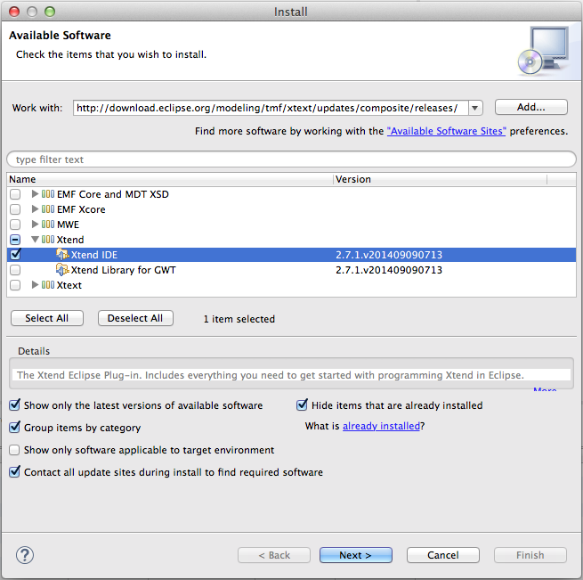
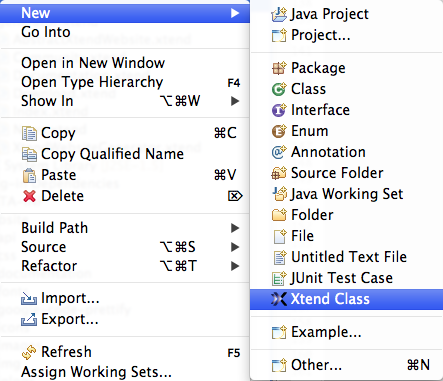
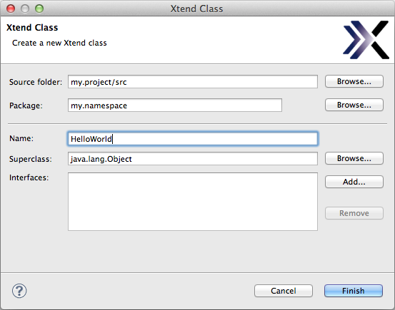
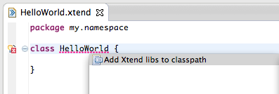

------

## Installation Instructions

The Xtend IDE integration requires Eclipse 3.6 or higher and a Java SDK 5 or higher. Use one of the update sites from above to install the full SDK into your running Eclipse. If you do not yet have an Eclipse on your machine, you can download one of the pre-packaged distributions on the right.

There are various options to compile Xtend sources. The most common way is using [the Maven plug-in](#maven-support).

### Install From Update Site {#update-site}

If you already have an Eclipse running you should install the *Xtend SDK*-Feature from one of the update sites listed above. To do so within Eclipse, choose *Help &rarr; Install New Software...*. In the upcoming dialog you should paste one of the update site URLs into the field named *Work with*. Now search for the feature *Xtend SDK*, select it, click *Next*, and on the next page *Finish*.



Now the features are downloaded and installed. Eclipse will ask you for a restart when downloading and installation is done.

### IntelliJ Idea / Android Studio Support {#intellij}

You can now try the developer preview for Xtend on IntelliJ. Add the following URL to your update manager

```
http://download.eclipse.org/modeling/tmf/xtext/idea/2.9.0.beta2/updatePlugins.xml
```

Then install all of the following plugins:

- org.eclipse.xtext.idea
- org.eclipse.xtext.xbase.idea
- org.eclipse.xtend.idea

### Download Runtime Libraries {#library}

If you do not use Maven or some Maven compatible build system, you can download the runtime library from the maven central manually:

*   [org.eclipse.xtext.xbase.lib (the extensions to JDK and Guava)](http://search.maven.org/#search%7Cga%7C1%7Corg.eclipse.xtext.xbase.lib)
*   [org.eclipse.xtend.lib (active annotations, such as @Accessors, @Data and @Delegate)](http://search.maven.org/#search%7Cga%7C1%7Corg.eclipse.xtend.lib)
*   [org.eclipse.xtend.lib.macro (the active annotations API)](http://search.maven.org/#search%7Cga%7C1%7Corg.eclipse.xtend.lib.macro)
*   [com.google.guava (Google Guava)](http://search.maven.org/#search%7Cga%7C1%7Ccom.google.guava%20a%3A%22guava%22)

Additionally there is a slim version of the library that includes a proguarded version of Google Guava. This is mainly intended for Android users.

*   [org.eclipse.xtext.xbase.lib.slim (ProGuarded version includes everything needed)](http://search.maven.org/#search%7Cga%7C1%7Corg.eclipse.xtext.xbase.lib.slim)

### Maven Plug-In {#maven-support}

The [runtime library](#library) as well as a plug-in to run the compiler in a Maven build can be be obtained from the Maven Central Repository: [http://repo.maven.apache.org/maven2](http://repo.maven.apache.org/maven2).

You can create a readily configured project with the following command.

```
mvn archetype:generate -DarchetypeGroupId=org.eclipse.xtend -DarchetypeArtifactId=xtend-archetype
```

If you already have a project with a *pom.xml*, you need to add the plugin configuration:

```xml
<plugin>
  <groupId>org.eclipse.xtend</groupId>
  <artifactId>xtend-maven-plugin</artifactId>
  <version>2.7.3</version>
  <executions>
    <execution>
      <goals>
        <goal>compile</goal>
        <goal>testCompile</goal>
      </goals>
      <configuration>
        <outputDirectory>${project.build.directory}/xtend-gen/main</outputDirectory>
        <testOutputDirectory>${project.build.directory}/xtend-gen/test</testOutputDirectory>
      </configuration>
    </execution>
  </executions>
</plugin>
```

The xtend-maven-plugin is [toolchain-aware](http://maven.apache.org/guides/mini/guide-using-toolchains.html), so you can build against different JDKs than the currently running one.

Xtend's *m2e* integration will automatically configure the Eclipse settings from the POM if you have the Maven project nature enabled.

Some users might not want Maven to be the leading system. For that case you can just leave out the *outputDirectory* configuration in the POM. The Xtend plugin will then look for Eclipse settings instead. The folder specified in the settings dialog is interpreted as a path relative to the current source folder.


### Getting the Runtime Library via Maven

The [runtime library]({{site.javadoc.xtext}}) is available from Maven Central, too: [http://repo.maven.apache.org/maven2](http://repo.maven.apache.org/maven2).

The XML for the dependency is:

```xml
<dependency>
  <groupId>org.eclipse.xtend</groupId>
  <artifactId>org.eclipse.xtend.lib</artifactId>
  <version>2.7.3</version>
</dependency>
```

------

## Getting Started


When you've started Eclipse for the first time, you should see an empty workspace. Switch to the *Java perspective* if you are not already in it. Xtend integrates with Java, so you need to create a Java project to get started. In the menu choose *File &rarr; New &rarr; Java Project*. In the upcoming dialog choose any project name you want (e.g. *my.project*). After clicking *Finish* Eclipse will create a fresh project with an empty source folder named */src*.

### A First Class



To create your first Xtend class select the source folder and press the right mouse button. You should find the entry *Xtend class* in the category *New*. If you don't see it you might not be in the Java perspective or you need to reset the perspective. To do so right click on the perspective icon on the top right and choose *reset*.



In the dialog you should give the class a name, for instance *HelloWorld*, and put it into some package (we chose *my.namespace*). Click *Finish* and an empty class will be created for you.

### The Missing Lib



The newly created class will have an error marker, saying that you need to put the library on the classpath. There is a *quickfix* which does that for you. Put the cursor on the marked location and press *Ctrl+1* (or *Cmd+1* on a Mac) and select the option *Add Xtend libs to the classpath*.

The library is also available [from Maven](#maven-support) or as an OSGi bundle from the p2 update site above.

### Have Fun!

Now you are ready to code. Within the class body (between the curly braces) type *main* and press *Ctrl+Space*. An empty main method will be generated for you.

Now type in `println('Hello World')`, save and run the application. To do so use the green arrow and choose *Run As &rarr; Java Application*.


[Click here for the next steps and more examples.](documentation/101_gettingstarted.html)
