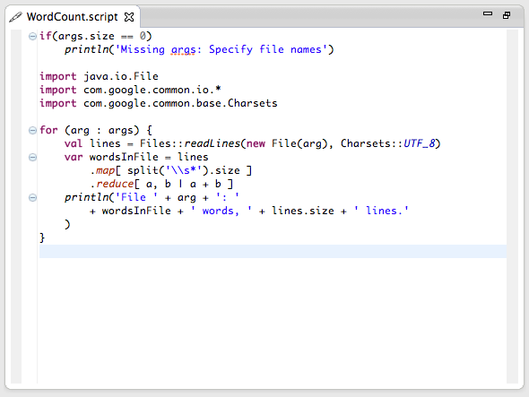

# Scripting Language {#scripting}

The scripting language allows writing code without any preludes such as package, class or method declarations. Just open a file and start coding. It's the simplest of the seven languages and is therefore a good starting point.



## Overview {#scripting-solution}

As you can see the language is straightforward: All you can do is write expressions. The expressions you see are the same as in Xtend and they are defined in its own grammar (called Xbase). They are syntactically very close to Java, but feature advanced concepts like lambda expressions and operator overloading. They support local type inference so you do not have to write types everywhere like in Java, but the expressions are still statically typed. For a Java developer, the code should be self-explanatory. The Xbase expression language is exhaustively covered in the respective [documentation section](17_xbase.html).

A script is compiled to a Java class with one main method. That is the script

```scripting
println('Hello World!')
```

is compiled to the following Java source code

```java
package my.first;

public class Application {
  public static void main(String... args) {
    System.out.println("Hello World!");
  }
}
```

Note that the core language infrastructure such as the parser, linker and compiler does not depend on Eclipse, but the compilation is integrated with Eclipse for convenience reasons. All 7 languages can be parsed, compiled and executed without Eclipse. We could also make use of the interpreter, which might make more sense for a scripting language. How to use and integrate the interpreter is explained in the section describing the [Tortoise](11_tortoise.html) language.

## Running the Example {#scripting-running}

Make sure you have the projects *org.xtext.scripting* and *org.xtext.scripting.ui* in your workspace. Then start a new Eclipse by choosing *Run &rarr; Run Configurations... &rarr; Eclipse Application &rarr; Run (org.xtext.scripting)*. Import the project *org.xtext.scripting.examples* into the newly spawned workspace using the *Import existing projects into workspace* wizard.

## Grammar {#scripting-grammar}

To build a language with Xtext, you first have to define a grammar. As opposed to other parser generators, an Xtext grammar defines both, the lexical structure of the language and an object model (the AST or semantic model) that is build during parsing. For a more detailed description of the Xtext grammar language, please see the respective [documentation section](13_grammarlanguage.html).

The grammar for our DSL is rather simple. We inherit from `org.eclipse.xtext.xbase.Xbase` to get the syntax of the expressions. As we want to refer to the type [XBlockExpression]({{site.src.xtext}}/plugins/org.eclipse.xtext.xbase/emf-gen/org/eclipse/xtext/xbase/XBlockExpression.java), we have to import Xbase's Ecore model. The single type inferred from this grammar goes into the Ecore model `simpleExpressions`.

```xtext
grammar org.xtext.scripting.Scripting with org.eclipse.xtext.xbase.Xbase

generate scripting "http://www.xtext.org/scripting/Scripting"
import "http://www.eclipse.org/xtext/xbase/Xbase"

Script returns XBlockExpression:
	{Script}
	(expressions+=XExpressionInsideBlock ';'?)*;
```

The main rule *Script* is defined to produce an object of type `Script`, which is a subtype of `XBlockExpression`. A block expression simply contains any number of expressions. The rule `XExpressionInsideBlock` is defined in the Xbase grammar. Usually block expressions are surrounded by curly braces, but of course we do not want to force anybody to write curly braces at the beginning and the end of a simple script.

## Translation to Java {#scripting-inferrer}

To make our language executable, we have to define how its concepts relate to Java concepts. In Xtext, this is defined by the [IJvmModelInferrer]({{site.src.xtext}}/plugins/org.eclipse.xtext.xbase/src/org/eclipse/xtext/xbase/jvmmodel/IJvmModelInferrer.java). The language generator automatically generates an Xtend stub for it. Nevertheless, it is up to the language developer to implement the `infer()` method. 

This hook is not only used to explain how to generate Java code, but also to give expressions a proper scope and to make your DSL constructs visible by other JVM languages. The Java type system is used as a common hub to integrate arbitrary languages with each other.

The inferrer is written in Xtend, if you are not yet familiar with it, you should read at least the [Xtend Primer](04_sevenlang_introduction.html#xtend-primer) first.

The JVM model inferrer code for the scripting language looks like this: 

```xtend
class ScriptingJvmModelInferrer extends AbstractModelInferrer {

  @Inject extension JvmTypesBuilder

  def dispatch void infer(Script script, 
                          IJvmDeclaredTypeAcceptor acceptor, 
                          boolean isPreIndexingPhase) {
    val className = script.eResource.URI.trimFileExtension.lastSegment
   	acceptor.accept(script.toClass(className))[
      // the class gets one main method
      members += script.toMethod('main', typeRef(Void.TYPE)) [
   	    parameters += script.toParameter("args",  typeRef(String).addArrayTypeDimension)
   	    static = true
        varArgs = true
        // Associate the script as the body of the main method
        body = script
      ]	
    ]
  }
}
```

It maps each script to one Java class with a main method. Note the use of `script` as a receiver for all the factory methods. When creating a Java element, you need to pass a context so Xtext knows what the origin of a Java element is. This is used throughout the workbench for features like find references, call hierarchies, rename refactoring and more.

As the whole script is an expression it is associated with the body of the main method. That association is important since it defines the scope of the expression. It includes the variables, fields and methods that are visible as well as which return type is expected.

In this case `void` is expected, so you would get an error when using a return expression. Also the parameter `args` defined in the main method is now on the scope. So you could write the following script:

```scripting
for (arg : args)
  println('-- '+arg)
```

As you can imagine, this is a fairly powerful way to put things on the scope implicitly. 

---

**[Next Chapter: Build Language](06_builddsl.html)**