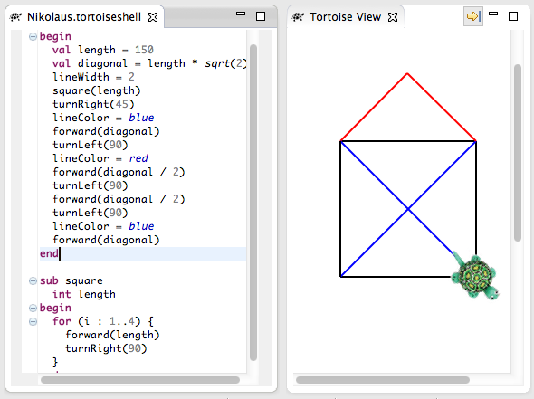
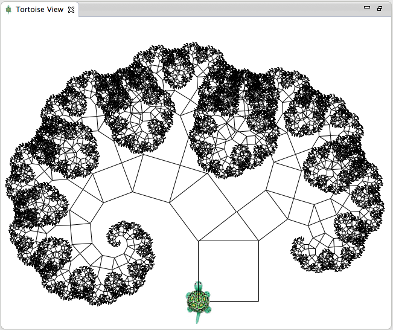

# Little Tortoise {#tortoise}

Do you remember the programming language [Logo](http://en.wikipedia.org/wiki/Logo_%28programming_language%29)? Logo was used in computer science classes to teach children how to program. In fact, it was a adaptation of LISP! But the remarkable part was the so-called *turtle*, a graphical cursor that can be given commands to move and turn, thereby drawing lines.



The goal is a language to control a turtle drawing an image. Technically, this example will teach you how to adapt and use the [XbaseInterpreter]({{site.src.xtext}}/plugins/org.eclipse.xtext.xbase/src/org/eclipse/xtext/xbase/interpreter/impl/XbaseInterpreter.java) for your own languages. 

## Overview {#tortoise-solution}

We have built a language that allows to define *Programs* and *SubPrograms*. Each of these has a body, which can contain any number of expressions. In addition to the standard Xbase expressions, we are able to issue commands to the tortoise. Here is an example explaining the concepts in comments: 

```tortoise
// Program: Haus vom Nikolaus
begin
  val length = 150                // local variable
  val diagonal = length * sqrt(2) // all Math.* methods are available
  lineWidth = 2                   // assignment of a property
  square(length)                  // call to a SubProgram
  turnRight(45)                   // call to a command method
  lineColor = blue                // all ColorConstants.* are available
  forward(diagonal)
  turnLeft(90)
  lineColor = red
  forward(diagonal / 2)
  turnLeft(90)
  forward(diagonal / 2)
  turnLeft(90)
  lineColor = blue
  forward(diagonal)
end  // main program

sub square           // a subprogram
  int length         // parameter
begin
  for (i : 1..4) {   // loop-expression from Xbase 
    forward(length)
    turnRight(90) 
  }
end  // sub square
```

The main trick about our solution is to *not* bake in the turtle commands into the language itself, but define it in the runtime library. This way, the language stays as slim as can be and additions can be easily added without the need to regenerate the whole language infrastructure.

The core of the runtime library is the class [Tortoise]({{site.src.sevenlang}}/languages/org.xtext.tortoiseshell.lib/src/org/xtext/tortoiseshell/lib/Tortoise.java). You can think of it as of our only domainmodel class: It keeps the current state of the tortoise and allows modifying it using methods. Here is an excerpt of its code:

```xtend
class Tortoise {
  double angle
  double x
  double y
  @Accessors int delay = 200

  boolean isPaint = true
  @Accessors int lineWidth
  @Accessors Color lineColor

  List<ITortoiseEvent.Listener> listeners = newArrayList()
...
```

When a method changes the state of the tortoise, an event is thrown. These events are consumed by a GEF based view and turned into animations of a [TortoiseFigure]({{site.src.sevenlang}}/languages/org.xtext.tortoiseshell.lib/src/org/xtext/tortoiseshell/lib/view/TortoiseFigure.xtend). This loose coupling of model and view allows for easier testing.

## Running the Example {#tortoise-running}

In the runtime Eclipse, open the *Tortoise View* (*Window &rarr; Show View &rarr; Other &rarr; Xtext &rarr; TortoiseView*). Then open one of the example files in *org.eclipse.xtext.tortoiseshell.examples*. The *Program* is interpreted on editor activation and on save. An additional toggle button *Step Mode* in the *Tortoise View* allows to execute the code live from the editor up to the caret's current line.



## Grammar {#tortoise-grammar}

The grammar is very short. Once again, we inherit from the Xbase language to have nice Java integration and rich expressions. A user can define a *Program*, which can have *SubPrograms* with parameters. The *Executable* rule is never called, but defines a common supertype for *Program* and *SubProgram* that will hold their common member `body`. A *Body* is an *XBlockExpression* from Xbase, but with the keywords `begin` and `end` instead of the curly braces.

```xtext
grammar org.xtext.tortoiseshell.TortoiseShell
  with org.eclipse.xtext.xbase.Xbase

import "http://www.eclipse.org/xtext/xbase/Xbase"
generate tortoiseShell "http://www.xtext.org/tortoiseshell/TortoiseShell"

Program :
  body=Body
  subPrograms+=SubProgram*;
  
SubProgram:
  'sub' name=ValidID (':' returnType=JvmTypeReference)?
  (parameters += FullJvmFormalParameter)*
  body=Body;

Body returns XBlockExpression:
  {XBlockExpression}
  'begin'
  (expressions+=XExpressionInsideBlock ';'?)*
  'end';
  
Executable:
  Program | SubProgram;
```

## Translation to Java {#tortoise-inferrer}

With the tortoise commands defined as methods in the runtime library class [Tortoise]({{site.src.sevenlang}}/languages/org.xtext.tortoiseshell.lib/src/org/xtext/tortoiseshell/lib/Tortoise.java), we have to infer a Java class that inherits from this. Within this class, we create a method for each *Program* and *SubProgram*. The resulting code looks like this:

```xtend
class TortoiseShellJvmModelInferrer extends AbstractModelInferrer {
  public static val INFERRED_CLASS_NAME = 'MyTortoiseProgram'
  
  @Inject extension JvmTypesBuilder
  
  def dispatch void infer(Program program, 
                          IJvmDeclaredTypeAcceptor acceptor, 
                          boolean isPreIndexingPhase) {
    acceptor.accept(program.toClass(INFERRED_CLASS_NAME))[
      superTypes += typeRef(Tortoise)
      if(program.body != null)
        members += program.toMethod("main", typeRef(Void.TYPE)) [
          body = program.body
        ]
      for(subProgram: program.subPrograms)
        members += subProgram.toMethod(subProgram.name, 
            subProgram.returnType ?: inferredType(subProgram.body)) [
          for(subParameter: subProgram.parameters)
              parameters += subParameter.toParameter(subParameter.name, subParameter.parameterType)
          body = subProgram.body
        ]
    ]
  }
 }
```

## Interpreter {#tortoise-interpreter}

The Xbase language library does not only provide a compiler that generates Java code, but also an [interpreter]({{site.src.xtext}}/plugins/org.eclipse.xtext.xbase/src/org/eclipse/xtext/xbase/interpreter/impl/XbaseInterpreter.java). This has been adapted to execute our *Programs*. 

After all an interpreter is just a big visitor. For each expression type, it has an evaluation method, that recursively calls the evaluation methods for the subexpressions for its arguments. The methods also pass an execution context storing all temporary state such as local variables.

The first thing we have to cope with is the mixture of existing Java methods (from the super class [Tortoise]({{site.src.sevenlang}}/languages/org.xtext.tortoiseshell.lib/src/org/xtext/tortoiseshell/lib/Tortoise.xtend)) and inferred ones. While the former are evaluated via Java reflection, we need special treatment for the latter. The idea is to bind an instance of [Tortoise]({{site.src.sevenlang}}/languages/org.xtext.tortoiseshell.lib/src/org/xtext/tortoiseshell/lib/Tortoise.xtend) to `this` and intercept calls to the inferred methods to execute them directly. This is accomplished by overriding the method `invokeOperation`:

```xtend
  @Inject extension IJvmModelAssociations
   
  override protected invokeOperation(JvmOperation operation, 
                                     Object receiver, 
                                     List<Object> argumentValues) {
    val executable = operation.sourceElements.head
    if (executable instanceof Executable) {
      val context = createContext
      context.newValue(QualifiedName.create("this"), tortoise)
      operation.parameters.forEach[p, i|
        context.newValue(QualifiedName.create(p.name), argumentValues.get(i))
      ]
      val result = evaluate(executable.body, context, CancelIndicator.NullImpl)
      if(result.exception != null)
        throw result.exception
      result.result
    } else {
      super.invokeOperation(operation, receiver, argumentValues)
    }
  }
```

One thing you have to know about the Java inferrence is that when creating Java elements using the [JvmTypesBuilder]({{site.src.xtext}}/plugins/org.eclipse.xtext.xbase/src/org/eclipse/xtext/xbase/jvmmodel/JvmTypesBuilder.java), the infrastructure stores the information which elements have been inferred from which source elements. To navigate these traces, we use the Xbase service [IJvmModelAssociations]({{site.src.xtext}}/plugins/org.eclipse.xtext.xbase/src/org/eclipse/xtext/xbase/jvmmodel/IJvmModelAssociations.java). So to detect whether a [JvmOperation]({{site.src.xtext}}/plugins/org.eclipse.xtext.common.types/emf-gen/org/eclipse/xtext/common/types/JvmOperation.java) is inferred, we check whether it has a source element. If so, we have to setup an execution context binding `this` and the parameters as local variables and then execute the method's body using the interpreter. 

To start the interpretation we have to do almost the same: Setup the execution context and then evaluate the *Program's* body. The respective code is 

```xtend
  override run(Tortoise tortoise, EObject program, int stopAtLine) {
    if(tortoise != null && program != null) {
      this.tortoise = tortoise
      this.stopAtLine = stopAtLine
      try {
        program.jvmElements.filter(JvmOperation).head
          ?.invokeOperation(null, #[])
      } catch (StopLineReachedException exc) {
        // ignore
      }
    }
  }
```

The [StopLineReachedException]({{site.src.sevenlang}}/languages/org.xtext.tortoiseshell/src/org/xtext/tortoiseshell/interpreter/TortoiseShellInterpeter.xtend#L74) is part of the *Step Mode*. It is thrown when the execution reaches the line `stopAtLine`, thus terminating the current execution. The throwing code is

```xtend
  override protected internalEvaluate(XExpression expression, 
                                      IEvaluationContext context, 
                                      CancelIndicator indicator) {
    val line = NodeModelUtils.findActualNodeFor(expression)?.startLine
    if(line-1 == stopAtLine)
      throw new StopLineReachedException
    super.internalEvaluate(expression, context, indicator)
  }
```

## Literal Classes {#tortoise-additions}

To make the static methods and fields of [Math]({{site.javadoc.java}}/java/lang/Math.html) and [ColorConstants]({{site.src.gef}}/org.eclipse.draw2d/src/org/eclipse/draw2d/ColorConstants.java) callable directly, we provided the [TortoiseShellImplicitlyImportedFeatures]({{site.src.sevenlang}}/languages/org.xtext.tortoiseshell/src/org/xtext/tortoiseshell/scoping/TortoiseShellImplicitlyImportedFeatures.xtend):

```xtend
class TortoiseShellImplicitlyImportedFeatures extends ImplicitlyImportedFeatures {
  override protected getStaticImportClasses() {
    (super.getStaticImportClasses() + #[Math, ColorConstants])
      .toList
	}
  }
}
```

To overcome a small issue in the interpreter we also had to implement the [TortoiseShellIdentifiableSimpleNameProvider]({{site.src.sevenlang}}/languages/org.xtext.tortoiseshell/src/org/xtext/tortoiseshell/scoping/TortoiseShellIdentifiableSimpleNameProvider.xtend). 

---

**[Next Chapter: Overview](12_overview.html)**