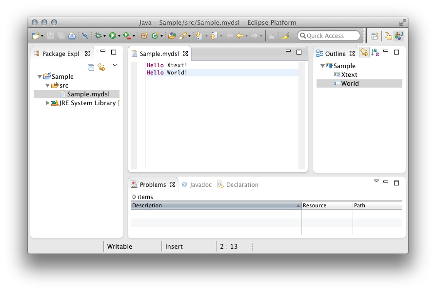

# 5 Minutes Tutorial {#first-five-minutes}

In this chapter you will learn how to create a new Xtext project, generate a fully working language infrastructure and how to start a new Eclipse instance in order to test the editor. But before we get started, make sure you have Eclipse Xtext properly installed.

## Creating A New Xtext Project {#new-project}

The first step is to create a new Xtext project by choosing *File &rarr; New &rarr; Project...*. The dialog offers a couple of different project types. Select *New Xtext Project* from the category *Xtext* and finish the wizard with the default settings. You will find 4 new projects in your workspace which are mostly empty. The Xtext grammar editor will be opened and show the definition of a very simple *Hello World* language.

```xtext
grammar org.xtext.example.mydsl.MyDsl with 
                                      org.eclipse.xtext.common.Terminals

generate myDsl "http://www.xtext.org/example/mydsl/MyDsl"

Model:
  greetings+=Greeting*;
  
Greeting:
  'Hello' name=ID '!';
```

The only thing this language does, is to allow to write down a list of greetings. The following would be proper input: 

```mydsl
Hello Xtext!
Hello World!
```


## Generating The Language Infrastructure {#run-workflow}

In order to test drive this language, you will have to generate the respective language infrastructure. Therefore, choose *Run As &rarr; Generate Xtext Artifacts* from the context menu of the grammar editor. A new Java process will be spawned and afterwards you will find a couple of new files in the projects that were created in the first step. What you see now is a runnable language infrastructure with a powerful Eclipse editor for a brain-dead language :-).

## Try The Editor {#testing-the-editor}

Let's give the editor a try. If you select *Run As &rarr; Eclipse Application* from the project's context menu, you can create a new Eclipse Application. A new Eclipse instance will be launched and allows to test drive the editor.


Before you can create a file for the sample language, you will have to create a sample project. Select *File &rarr; New &rarr; Project...* and choose a project type of your choice, e.g. *Java Project*, name it *Sample* and create a new file in the *src* folder of the project: From the context menu of the folder choose *New &rarr; File*, call it *Sample.mydsl* and hit *Finish*. The newly created editor will open for your language and ask you in a dialog, whether you want to add the Xtext nature to your project, which should be confirmed. You can now give the editor a try, e.g. use content assist (*Ctrl+Space*) to insert the keyword `Hello` and see how the input is validated immediately.



## Conclusion {#five-minutes-conclusion}

In your first five minutes with Xtext, you have learned how to create a new set of projects. You have run Xtext's code generation in order to get a fully working language infrastructure, and finally learned how to test the generated editor.

Next up you should go through the more comprehensive [Domain Model Example](01_domainmodelwalkthrough.html). It explains the different concepts of the Xtext grammar language and illustrates how to customize various aspects of the language. 

---

**[Next Chapter: 15 Minutes Tutorial](01_domainmodelwalkthrough.html)**